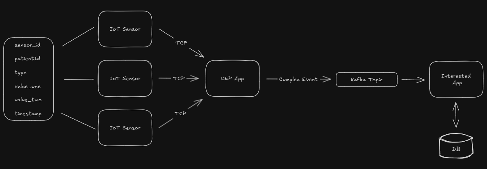

### CEP Healthcare Example
A demonstration of <b>Complex Event Processing (CEP)</b> applied to patients vital signs monitoring.
This project utilizes <b>Drools Rule Engine</b> to analyze real-time data and  detect anomalies.

### 🛠 Technologies
* Java
* Drools Rule Engine
* Apache Kafka
* TCP Protocol

### Architecture


### System Flow
1️⃣ - A <b>Java application simulates IoT sensors</b>. It runs three different threads,
each generating and sending 200 data per second via TCP to the CEP App 

2️⃣ - The <b>Cep APP</b> powered by <b>Drools Rule Engine</b>, processes events and
detect anomalies based on predefined rules.

3️⃣ - When an anomaly is detected, a <b>Complex Event</b> is published into a Kafka Topic.

4️⃣ - An <b>interested application</b> consumes these events, storing them and printing in the console (Could trigger notifications).

### ⚠ Disclaimer
The rules and generated data <b>do not have any scientific basis</b> and <b>are not validated</b> by any medical 
community or healthcare service. They are used <b>solely for demonstration purposes</b> in this project.

### ⚙ Drools Configuration
* STREAM mode (event-based processing)
* Engine Active Mode (rules are fired automatically whenever a pattern is matched)

### 🚩 Getting Started

- 1 - <b>Clone the project</b>

```bash
    git clone https://github.com/BernardoDenkvitts/cep-healthcare-example.git
```

- 2 - <b>Start Kafka</b>

```bash
    docker-compose up -d
```

- 3 - <b>Create Kafka Topic</b>

```bash
     docker exec cep-healthcare-example-kafka-1 kafka-topics.sh --create --topic alert-topic --bootstrap-server localhost:9092 --partitions 3 --replication-factor 1
```

- 4 - <b>Run the applications</b>
    * <b>1°</b> - CepApp
    * <b>2°</b> - AlertConsumer OR SensorSimulator